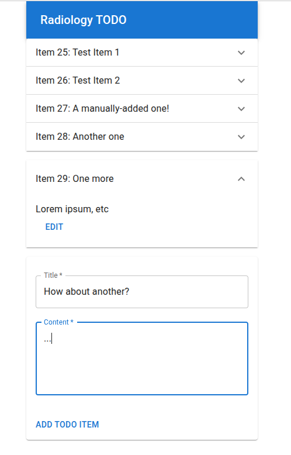

# TODO app for radiologists

This repo contains my submission for a take-home assignment I got a job application.

The requirements for the app were basically:
* Small to-do task management API and frontend
* Backend uses .NET Core
* Database uses EF Core in-memory or SQLite
* Frontend uses React or Vue

This README.md is a high-level description of my approach to this assignment.
For a more "raw", stream-of-consciousness record of what I did, see NOTES.txt.
For low-level, but "curated" (not stream-of-consciousness) descriptions of
my solution, see the comments in:
* backend/Backend.cs
* frontend/src/App.js

NOTE: I didn't use an LLM for any of this: in particular, all words in the
documentation & comments are my own.

NOTE: I didn't use an IDE for any of this, which works fine for Python (long
live the REPL, particularly iPython), but doesn't work so well for C#.
I tried to find a REPL for it, but that... doesn't seem to be a thing.
There's `dotnet-repl`, which is someone's side project, and is okay for
experimenting with basic language functionality, but not much more than that.
If I were to be working with .NET a lot, I would switch to VSCode or
something.

## The plan

I had never used .NET Core before, and I hadn't done UI stuff in a while, so
this assignment was a chance to dust off some old skills and learn some new
ones.
I didn't end up being able to do as much as I would have liked, but there's
definitely a functional application here, meeting the stated requirements.

I had some experience with the Microsoft stack, all the way from VB6 and
Classic ASP, through VB.NET and C# and ASP.NET.
So I understood the C# language well enough, but had only ever worked on
existing codebases, never created one from scratch.
I have lots of experience with creating Python web services from scratch,
using e.g. Django and Flask.
So my plan was to approach .NET Core by thinking about what I would do in
Django, and then finding tutorials and documentation for the .NET Core
equivalents.

The requirements didn't say much about the TODO app's design or functionality.
I wanted to show some creativity if possible, so I thought about what the company
which I was applying was doing: "AI-driven MRI scans".
I imagined a TODO app for radiologists, where each TODO item has an associated MRI
image, and asks the radiologist to outline things within it (tumors, etc).
The outlining could be done with a simple <canvas>-based component, allowing the
user to draw red lines on the image.
Also, I had worked previously with HL7 (a health industry data exchange protocol),
and saw HL7 listed as a nice-to-have in the job description, so I imagined an
HL7 "listener" service which would generate TODO items from HL7 messages.
However, I ran up against the deadline, and didn't end up having time for
either of those!..
I did find some HL7 packages for .NET which I believe would have made it
relatively simple to set up an HL7 listener:
https://github.com/nHapiNET/nHapi
https://github.com/dib0/NHapiTools
https://github.com/dib0/HL7Fuse

## The result

## Learning .NET Core

Microsoft's official docs are fantastic, so I basically just used those.
There was the occasional case of googling a weird error message and finding
a StackOverflow answer for it.
I used `dotnet new webapi` as the basis for my backend program, which gave me
a .csproj, some configuration stuff like launch settings, and a Program.cs
entry point.
I ended up totally rewriting Program.cs, and renaming it to Backend.cs.
I kept the number of .cs files to a minimum, so that I could write long
comments and let assignment reviewers read them without having to switch
between a bunch of tiny files:
* Backend.cs
* Models.cs
* Controllers.cs

## Making the React app

I've done some React in the past, but never created a React app from scratch.
I used `npx create-react-app` for the basic scaffold, Material UI for the
components, and SWR for managing the data fetching.
https://create-react-app.dev/
https://mui.com/material-ui/
https://swr.vercel.app/

The entire app is in App.js.
For readability, I didn't split it up into separate files for components,
services, etc.

I ended up running out of time, so TODO items can't be edited, but new
ones can be added.

I really liked SWR; it meant I didn't have to bother doing any React
state/effect/trigger stuff directly.
It basically monitored my "list items" API endpoint for me, and all
I needed to do was render the data it returned (and let it know if I
created or updated an item).

## The design

I was learning a lot of stuff on a tight deadline, so I tried to keep the
design minimal.
The API has an endpoint which lists TODO items; the frontend hits that and
renders a list of TODO items.
Each item has a title, some "content" text, and a "completed" checkbox.
At the bottom, there's an "add item" form.
Each item can be expanded in place, to see or edit its details.
I didn't end up adding any pagination, filters, etc, so as it stands, the
design doesn't scale very well beyond 10 or so TODO items.

## Running locally

In one terminal:

    $ cd backend
    $ dotnet ef database update
    $ ./run.sh

In another terminal:

    $ cd frontend
    $ npm i
    $ ./run.sh

The backend runs at localhost:3001, the frontend at localhost:3000.
The backend configures CORS to allow frontend to access it.

TODO: add Dockerfile support for docker-compose

## Integration Tests

There is a test suite which hits the API.
Make sure the backend is running locally (see above), then:

    $ ./apitests.sh 
    === Clearing the database...
    === Checking for empty array of items...
    === Adding an item...
    === Checking for array of 2 items...
    === Checking item details...
    === Updating item...
    === Test suite OK!

Yes, I know there are better integration test frameworks than a bash script.
Sorry about that; see apitests.sh for details!

## Unit tests

I ran out of time, and was only able to add the integration tests (see above).
However, it is technically possible to run unit tests for the backend and
frontend:

For the backend (0 tests):

    $ cd backend
    $ dotnet test

For the frontend (1 test):

    $ cd frontend
    $ npm i
    $ npm test

For .NET Core, it looks like I would need to add a separate test project:
https://learn.microsoft.com/en-us/dotnet/core/testing/unit-testing-csharp-with-nunit
> Change the directory to the PrimeService.Tests directory and create
> a new project using the following command:
> dotnet new nunit

...I don't actually understand the .NET build system well enough to know
how projects are connected, e.g. how the unit test project would import
classes from the backend project.
I was hoping to learn more about that when adding the HL7 listener, which
I assumed would ideally share some code (e.g. models) with the API backend.
Alas, no time!..

## End-to-end tests

We could use something like Selenium to test the full application, frontend
and backend together... but I definitely have no time left for that.
